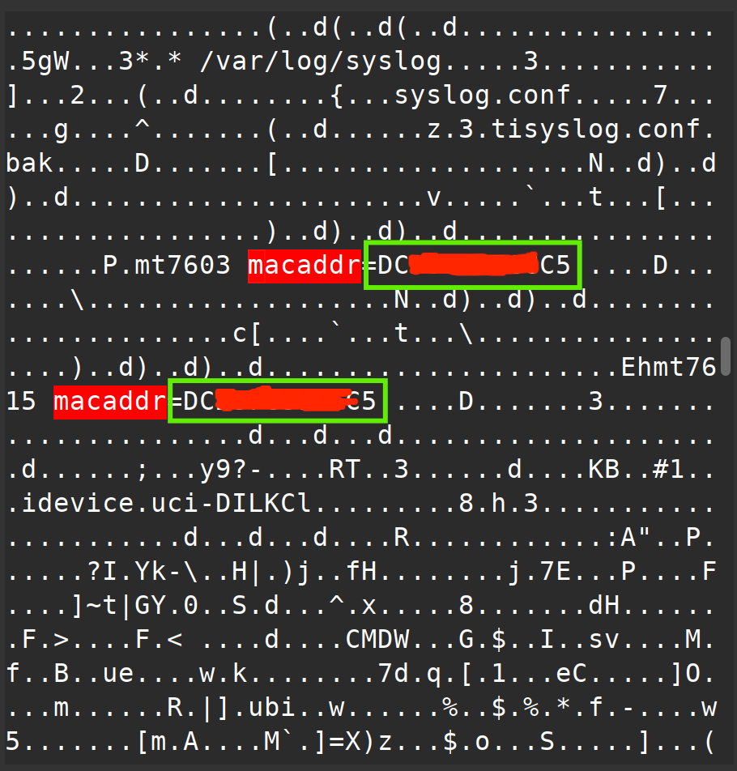
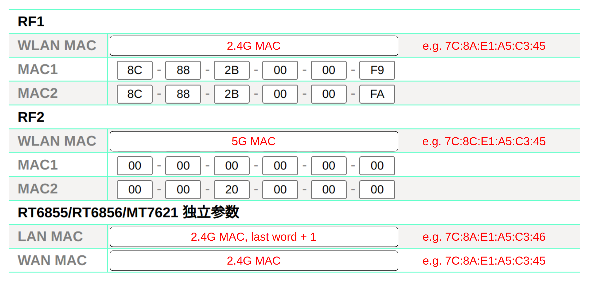

# What's this

Openwrt firmware for JDCloud RE-SP-01B. Build from openwrt official source, using config file: `JDCloud-RE-SP-01B.config`.

# Flash Firmware

## Prerequisites

1. Make sure you have a backup of the stock firmware, let's say `stock.bin`;
2. Use any hex editor to search inside `stock.bin` for "macaddr", you'll find the **mt7603 macaddr** (2.4G MAC) and the **mt7615 macaddr** (5G MAC) (Figure 1), be sure to write them down;
3. Save `stock.bin` data from 0x40000 to 0x4FFFF as `eeprom.bin`.

Figure 1:

## First Time Flash

If you came from other firmware, please do:

1. Flash breed (if not already done);
2. Flash openwrt firmware and `eeprom.bin` using breed web;
3. Alter MAC address using breed web (Figure 2);
4. Reboot.

Figure 2:

## Upgrade

1. Backup openwrt configurations;
2. Flash openwrt firmware using breed web;
3. Reboot and restore backup.

